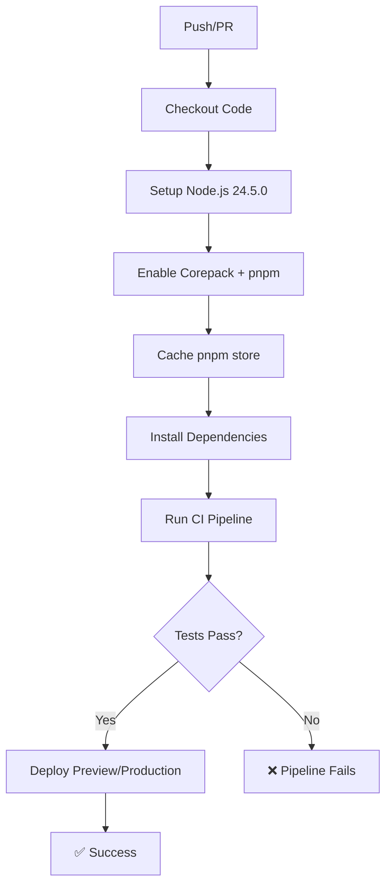

# Integração CI/CD com Testes Automatizados

## 🚀 Pipeline de CI/CD Atualizada

A pipeline de CI/CD foi atualizada para incluir os **82 testes automatizados** implementados no projeto.

### 📋 Fluxo da Pipeline



### 🔧 Comando CI Integrado

O comando `test:ci` executa **todos os checks** em sequência:

```bash
npm run test:ci
# Executa:
# 1. npm run lint          # ESLint
# 2. npm run type-check    # TypeScript
# 3. npm run test:run      # 82 testes
# 4. npm run build         # Build produção
```

### 📊 Cobertura de Testes na Pipeline

| Categoria | Testes | Status |
|-----------|--------|--------|
| **Utilitários** | 11 | ✅ |
| **Hooks** | 45 | ✅ |
| **Componentes** | 7 | ✅ |
| **Contexto** | 2 | ✅ |
| **Serviços** | 9 | ✅ |
| **Básicos** | 8 | ✅ |
| **TOTAL** | **82** | ✅ |

### 🎯 Gatilhos da Pipeline

A pipeline é executada automaticamente em:

- **Push para `main`** → Deploy de produção
- **Push para `develop`** → Apenas testes
- **Pull Request** → Deploy de preview + testes

### 🔒 Segredos Necessários

A pipeline usa os seguintes secrets do GitHub:

```yaml
VITE_SUPABASE_URL: ${{ secrets.VITE_SUPABASE_URL }}
VITE_SUPABASE_ANON_KEY: ${{ secrets.VITE_SUPABASE_ANON_KEY }}
VITE_N8N_WEBHOOK_URL: ${{ secrets.VITE_N8N_WEBHOOK_URL }}
VERCEL_TOKEN: ${{ secrets.VERCEL_TOKEN }}
VERCEL_ORG_ID: ${{ secrets.VERCEL_ORG_ID }}
VERCEL_PROJECT_ID: ${{ secrets.VERCEL_PROJECT_ID }}
```

### ⚡ Benefícios da Integração

1. **Qualidade Garantida**: Nenhum código quebra os testes chega à produção
2. **Feedback Rápido**: Desenvolvedores sabem imediatamente se há problemas
3. **Deploy Seguro**: Apenas builds que passam em todos os testes são deployados
4. **Cobertura Completa**: 82 testes cobrem as funcionalidades críticas
5. **Prevenção de Regressões**: Mudanças que quebram funcionalidades existentes são detectadas

### 🛠️ Comandos Locais

Para testar localmente antes do push:

```bash
# Executar todos os checks (igual à pipeline)
npm run test:ci

# Executar apenas os testes
npm run test:run

# Executar testes em modo watch
npm run test

# Executar apenas lint
npm run lint

# Executar apenas type-check
npm run type-check
```

### 📈 Monitoramento

- **Status da Pipeline**: Visível no GitHub Actions
- **Logs Detalhados**: Cada step tem logs específicos
- **Tempo de Execução**: ~2-3 minutos para pipeline completa
- **Notificações**: GitHub envia notificações de sucesso/falha

### 🔄 Fluxo de Desenvolvimento

1. **Desenvolvimento Local** → `npm run test:ci`
2. **Commit + Push** → Pipeline automática
3. **Pull Request** → Preview deploy + testes
4. **Merge para main** → Deploy produção

### 🚨 Falhas na Pipeline

Se a pipeline falhar:

1. **Verificar logs** no GitHub Actions
2. **Corrigir problemas** localmente
3. **Executar** `npm run test:ci` localmente
4. **Fazer novo commit** para re-executar pipeline

---

**Resultado**: Pipeline robusta que garante qualidade e confiabilidade do código em produção! 🎉
